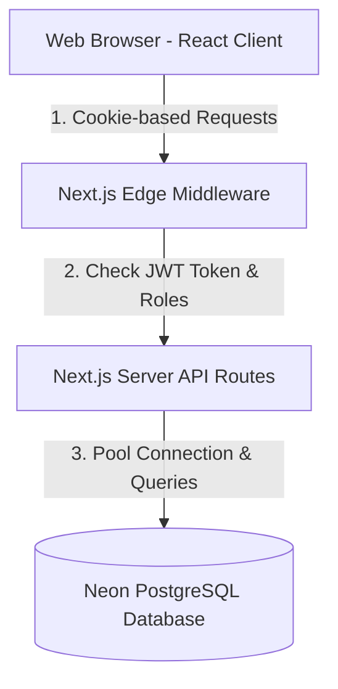

# AasaMedChem - Inventory & Order Management System

Welcome to the **AasaMedChem** Inventory and Order Management System. This application is designed to handle pharmaceutical and chemical product inventories, high-precision unit conversions, real-time quotation generation, and admin status auditing.

---

## 🌟 Features

- **Obsidian Emerald Theme**: A modern, dark-mode glassmorphic user interface designed with custom Vanilla CSS variables, smooth micro-animations, and responsive layouts.
- **Secure Role-Based Authentication**: Custom JWT-based authentication stored in `HttpOnly` cookies, secured via Next.js Edge Middleware protecting admin and seller dashboards.
- **Real-Time Unit Conversions**: Seamlessly place orders or quotations in any compatible unit (e.g. ordered in `kg` when base is `g`, or ordered in `L` when base is `mL`) with instant client-side calculation previews.
- **High-Precision Calculations**: Integrated `big.js` to perform exact numeric math, avoiding Javascript's native floating-point inaccuracy.
- **Transactional Stock Integrity**: Concurrent orders are handled safely using PostgreSQL database transactions with row-level locks (`SELECT FOR UPDATE`) and stock deduction validations.
- **Verification Audit Log**: Clear mathematical breakdowns are saved to the database and exposed in both seller history and admin portals to verify conversions and rates.
- **Self-Service Seeding**: A built-in developer utility banner on the login screen automatically initializes database tables and seeds demo products/users in a single click.

---

## 🛠️ Tech Stack & Architecture

- **Frontend**: Next.js 15 (App Router, React 19, TypeScript)
- **Styling**: Custom Vanilla CSS & CSS Modules (Obsidian Emerald Theme)
- **Database**: Neon-hosted serverless PostgreSQL
- **Database Driver**: `pg` (with connection pooling via `pg.Pool`)
- **Token Cryptography**: `jose` (Edge runtime compatible for Next.js Middleware)
- **Numeric Precision**: `big.js` (decimal arithmetic)

### High-Level Architecture Diagram


---

## 📊 Database Schema & Precision Strategy

All numeric fields (prices, stock quantities, ordered quantities, conversion factors) are stored as PostgreSQL `NUMERIC` types to support high decimal precision (up to 6 decimals for storage, and 10 decimals for conversion ratios) and avoid rounding anomalies.

### Key Tables

#### 1. `users`
Tracks system credentials and role permissions.
- `id`: `SERIAL` (Primary Key)
- `email`: `VARCHAR(255) UNIQUE` (User email)
- `password_hash`: `VARCHAR(255)` (Bcrypt hash)
- `role`: `VARCHAR(50)` (Strictly `'admin'` or `'seller'`)
- `name`: `VARCHAR(255)` (Display Name)

#### 2. `products`
Maintains chemical inventory base configuration.
- `id`: `SERIAL` (Primary Key)
- `sku`: `VARCHAR(100) UNIQUE` (Stock Keeping Unit)
- `name`: `VARCHAR(255)` (Product Name)
- `description`: `TEXT`
- `category`: `VARCHAR(100)`
- `base_unit`: `VARCHAR(20)` (Strictly `'g'`, `'kg'`, `'mL'`, `'L'`, or `'item'`)
- `base_price_inr`: `NUMERIC(20, 6)` (Price per single base unit in INR)
- `stock_quantity`: `NUMERIC(20, 6)` (Current inventory level in terms of the base unit)

#### 3. `orders`
Stores quotation headers.
- `id`: `SERIAL` (Primary Key)
- `user_id`: `INTEGER` (References `users(id)`)
- `status`: `VARCHAR(50)` (`'pending'`, `'approved'`, `'rejected'`, `'completed'`)
- `total_price_inr`: `NUMERIC(20, 6)` (Grand total order price)

#### 4. `order_items`
Tracks itemized ordered lines, locking in rates and audit ratios.
- `id`: `SERIAL` (Primary Key)
- `order_id`: `INTEGER` (References `orders(id)`)
- `product_id`: `INTEGER` (References `products(id)`)
- `quantity`: `NUMERIC(20, 6)` (Quantity ordered by the seller in the *ordered unit*)
- `unit`: `VARCHAR(20)` (The unit used for this specific line item)
- `calculated_price_inr`: `NUMERIC(20, 6)` (Total price for this line in INR)
- `base_price_at_order`: `NUMERIC(20, 6)` (Product's base price when the order was submitted)
- `conversion_factor_used`: `NUMERIC(20, 10)` (Exact ratio applied to convert ordered unit to base unit)

---

## 📏 Unit Storage & Conversion Strategy

### 1. Storage Rule
All stock quantities and prices are recorded **exclusively** relative to the product's configured `base_unit`. For example:
- A product configured in grams (`g`) with a price of `1.50 INR / g` will store `1.500000` as the price.
- A product configured in kilograms (`kg`) with a price of `120.00 INR / kg` will store `120.000000` as the price.

### 2. Supported Units & Dimensions
We support three independent physical dimensions. Conversions across dimensions (e.g. converting `g` to `mL`) are blocked.
- **Weight**: grams (`g`), kilograms (`kg`) [Conversion: `1 kg = 1000 g`]
- **Volume**: milliliters (`mL`), liters (`L`) [Conversion: `1 L = 1000 mL`]
- **Count**: items (`item`) [Conversion: `1 item = 1 item`]

### 3. Application Points
- **Client Side (Cart)**: When typing a quantity and changing the unit select, the UI immediately loads the product base unit, computes the conversion factor, calculates the converted base quantity, and evaluates the final price live using `big.js`.
- **Server Side (API Transaction)**: Before saving the order, the API fetches the product data directly from the DB, locks the row to prevent concurrent alterations, recalculates the conversion factor/base quantity, verifies stock limits, deducts the stock, and inserts the item with the exact `conversion_factor_used` logged.
- **Verification Audits**: Placed orders save `conversion_factor_used` and `base_price_at_order` to prevent retroactive rate changes and allow both Sellers and Admins to inspect the math.

---

## 🚀 Setup & Installation

### 1. Prerequisites
Ensure you have **Node.js 18+** installed.

### 2. Configure Environment
1. Clone the project.
2. In the workspace root, copy the environment template:
   ```bash
   cp .env.local.example .env.local
   ```
3. Open `.env.local` and paste your **Neon PostgreSQL** Connection URL:
   ```
   DATABASE_URL="postgresql://[user]:[password]@[neon-host]/[db-name]?sslmode=require"
   JWT_SECRET="generate-a-secure-secret-key-containing-32-chars"
   ```

### 3. Install & Start Dev Server
```bash
# Install npm dependencies
npm install

# Start the Next.js local development server
npm run dev
```
Open [http://localhost:3000](http://localhost:3000) in your browser.

---

## ⚡ Setup & Seeding Database

When accessing the app for the first time, you will see a red **"Database Setup Required"** banner on the login screen if the PostgreSQL tables do not exist.
1. Click the **"Initialize & Seed Database"** button directly on the login screen.
2. The server will run the `db_schema.sql` script to create all tables/triggers, hash passwords, and seed the demo data.
3. Once initialized, the banner turns green, and you can log in immediately.

---

## 🔑 Test Credentials & Verification Flows

Use the prefilled evaluator quick buttons on the login card, or enter credentials manually:

### 👤 Seller Account
- **Email**: `seller@asamed.com`
- **Password**: `seller123`
- **Verification Flow**:
  1. Click **Prefill Seller** and sign in.
  2. Search for `"Aspirin"` or filter by category `"Solvents"`.
  3. Click **Add to Quotation** on Ethanol (Base: `L`, Price: `₹350/L`).
  4. In the cart drawer, enter `500` as the quantity and change the unit to `mL`.
  5. **Inspect the live Conversion Audit box**: It correctly demonstrates that `500 mL = 0.5000 L` and calculates `0.5 L × 350.00 = ₹175.00`.
  6. Try to enter `30000` mL. Notice the validation triggers an error: `Exceeds stock limit`.
  7. Reduce to `2000` mL (2 L) and click **Place Quotation / Order**.
  8. Click on **Order History** in the sidebar. Click the order to view the full archived verification log of your conversion.

### 👑 Admin Account
- **Email**: `admin@asamed.com`
- **Password**: `admin123`
- **Verification Flow**:
  1. Log in as Admin.
  2. In **Manage Inventory**, click **Add Product** to create custom chemical inventory items with custom rates, categories, and units.
  3. Edit existing product stock levels or prices using the inline modal.
  4. Go to **Manage Orders** in the sidebar.
  5. Select the pending order placed by the seller.
  6. **Inspect the Audit Verification Log** on the right side: verify that the conversion ratio and formula are exact.
  7. Click **Approve** to accept the quotation, **Reject** (which automatically restores the seller's reserved stock to inventory), or **Complete**.

---

## ☁️ Deploying to Vercel

### Setup Vercel CLI
1. Log in to Vercel from your terminal:
   ```bash
   npx vercel login
   ```
2. Link your project to Vercel:
   ```bash
   npx vercel link
   ```
3. Add environment secrets via the Vercel Dashboard or run:
   ```bash
   npx vercel env add DATABASE_URL
   npx vercel env add JWT_SECRET
   ```
4. Deploy to production:
   ```bash
   npx vercel --prod
   ```
5. Run the DB Initializer on your deployed production URL: `https://[your-app-domain]/api/db-init?reset=true` to create tables on your production Neon instance.
